# JavaScript Fundamentals Assignment

25 questions and 5 brain teasers covering variables, scope, data types, functions, arrays, JSON, operators, conditionals, loops, and exception handling.

Run any file with `node filename.js`.

---

## Variables and Scope

### Question 1

Create a variable called `bunny` using `var` and assign it your bunny's name. Then declare `dog` with `let` and `cat` with `const`. Print all three names.

**Solution**

```javascript
var bunny = "Messi";
let dog = "Tommy";
const cat = "Whiskers";

console.log("Bunny's name:", bunny);
console.log("Dog's name:", dog);
console.log("Cat's name:", cat);
```

**Output**

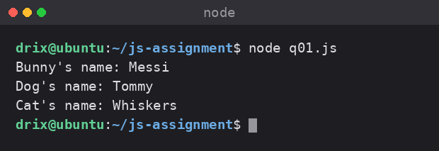

---

### Question 2

Which of these names are allowed in JavaScript? For each one, write valid or invalid, then write a correct version of any invalid name.

`1bunny` · `_bunny` · `$bunny` · `-bunny` · `@bunny` · `bunnyName`

**Solution**

| Name | Verdict | Reason | Correct version |
|---|---|---|---|
| `1bunny` | Invalid | Cannot start with a digit | `bunny1` |
| `_bunny` | Valid | | |
| `$bunny` | Valid | | |
| `-bunny` | Invalid | The hyphen is read as the subtraction operator | `bunny` |
| `@bunny` | Invalid | `@` is not a legal identifier character | `bunny` |
| `bunnyName` | Valid | | |

An identifier may begin with a letter, an underscore (`_`), or a dollar sign (`$`), and may contain digits after the first character.

---

### Question 3

Predict the output, then run the code. In one or two sentences, explain why `var` and `let` behave differently here.

```javascript
console.log(pet);
var pet = 'lucy';

console.log(animal);
let animal = 'tom';
```

**Solution**

The two snippets are run separately, because the second one throws and would stop the file before the first could print.

```javascript
// q03a.js
console.log(pet);
var pet = 'lucy';
```

```javascript
// q03b.js
console.log(animal);
let animal = 'tom';
```

**Output**

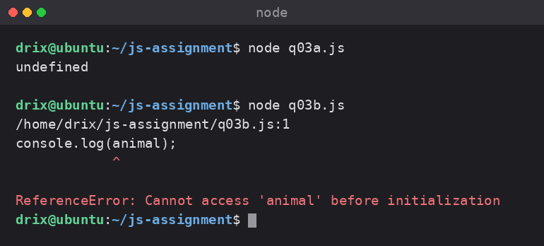

**Explanation**

`var pet` is hoisted to the top of its scope and initialised to `undefined`, so reading it early prints `undefined` instead of failing. `let animal` is hoisted too, but it stays in the temporal dead zone until the declaration line runs, so reading it early throws a `ReferenceError`.

---

### Question 4

Write two short examples: a local variable inside a function, and a global variable that the same function can still print. Call the function and show both results.

**Solution**

```javascript
// Global variable
let globalAnimal = "Dog";

function printNames() {
  // Local variable
  let localAnimal = "Cat";
  console.log("Global variable:", globalAnimal);
  console.log("Local variable:", localAnimal);
}

printNames();
```

**Output**

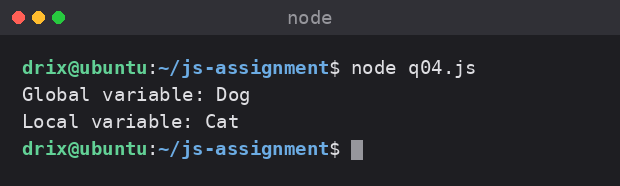

The two variables need different names. If both were called `animalNames`, the inner declaration would shadow the outer one and the function would print `Cat` twice.

---

## Data Types

### Question 5

Declare a variable named `bunny` and assign it an object with `name` (string), `age` (number), and `isHappy` (boolean). Print each property.

**Solution**

```javascript
var bunny = {
  name: "Lucy",
  age: 3,
  isHappy: true
};

console.log("Bunny's name:", bunny.name);
console.log("Bunny's age:", bunny.age);
console.log("Bunny is happy:", bunny.isHappy);
```

**Output**

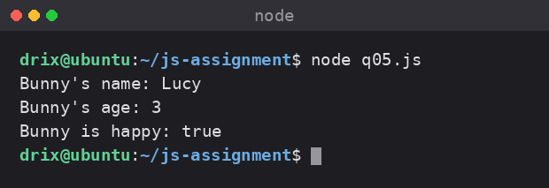

---

### Question 6

For each value below, print the value and its type using `typeof`:

`3.14` · `'Lucy'` · `true` · `null` · `undefined` · `Symbol('Lucy')` · `{ name: 'Lucy' }` · `['Lucy', 'Tom']`

**Solution**

```javascript
var values = [3.14, 'Lucy',
              true, null,
              undefined, Symbol('Lucy'),
              { name: 'Lucy' },
              ['Lucy', 'Tom']];

values.forEach(value => {
  console.log("Value:", value, "Type:", typeof value);
});
```

**Output**

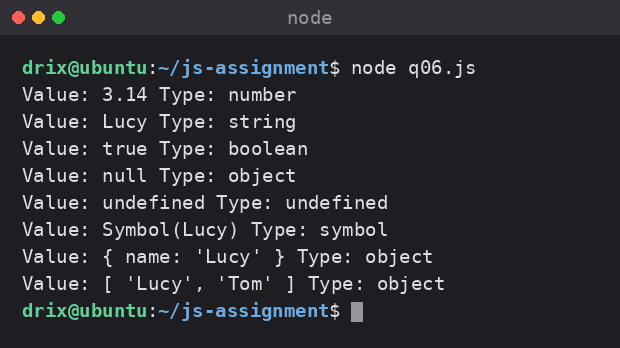

---

### Question 7

Create an array called `mixedDataTypes` that holds at least one boolean, one number, one string, `null`, `undefined`, and one object. Print the array and its length.

**Solution**

```javascript
let mixedDataTypes = [true, 42, 'Hello', null, undefined, { name: 'Lucy' }];

console.log("Mixed Data Types Array:", mixedDataTypes);
console.log("Length of the array:", mixedDataTypes.length);
```

**Output**

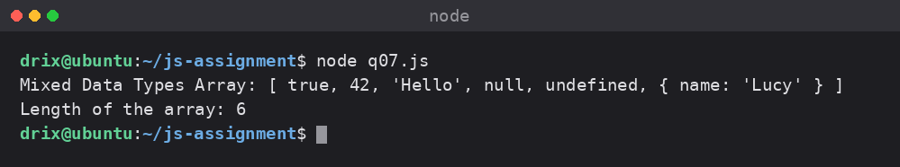

---

## Functions

### Question 8

Write a function `sumBunnies` that has no parameters. Inside it, create `blackBunnies = 10` and `whiteBunnies = 20`, add them, and return the total. Call the function and print the result.

**Solution**

```javascript
function sumBunnies() {
  let blackBunnies = 10;
  let whiteBunnies = 20;
  return blackBunnies + whiteBunnies;
}

console.log("Total bunnies:", sumBunnies());
```

**Output**

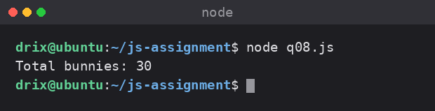

---

### Question 9

Rewrite `sumBunnies` so it takes two parameters, `blackBunnies` and `whiteBunnies`. Call it with `sumBunnies(10, 20)` and with `sumBunnies(7, 3)`.

**Solution**

```javascript
function sumBunnies(blackBunnies, whiteBunnies) {
  return blackBunnies + whiteBunnies;
}

console.log("Total bunnies (10, 20):", sumBunnies(10, 20));
console.log("Total bunnies (7, 3):", sumBunnies(7, 3));
```

**Output**

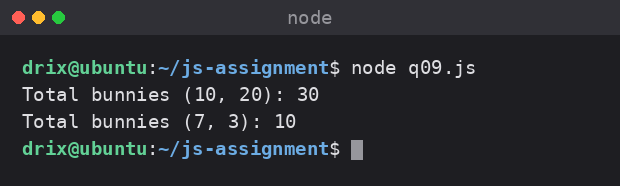

---

### Question 10

Rewrite question 9 as an anonymous function stored in a variable, and as an arrow function. Call both and print the results.

**Solution**

```javascript
// Anonymous function
const sumBunniesAnonymous = function(blackBunnies, whiteBunnies) {
  return blackBunnies + whiteBunnies;
};

// Arrow function
const sumBunniesArrow = (blackBunnies, whiteBunnies) => blackBunnies + whiteBunnies;

console.log("Total bunnies (Anonymous, 10, 20):", sumBunniesAnonymous(10, 20));
console.log("Total bunnies (Arrow, 7, 3):", sumBunniesArrow(7, 3));
```

**Output**

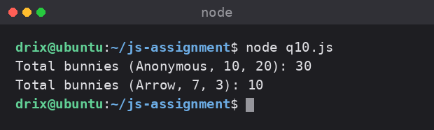

---

### Question 11

Write an IIFE that adds 10 black bunnies and 20 white bunnies and prints the total as soon as the file runs. Do not call it by name afterwards.

**Solution**

```javascript
(function() {
  let blackBunnies = 10;
  let whiteBunnies = 20;

  console.log("Total bunnies (IIFE):", blackBunnies + whiteBunnies);
})();
```

**Output**

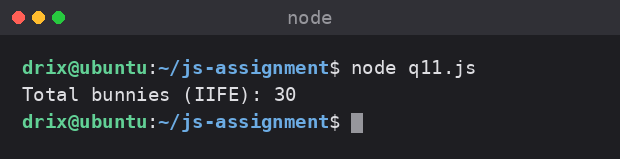

---

## Arrays

### Question 12

Create an array called `bunnies` with six bunny names. Add `Mario` to the end, add `Luigi` to the beginning, remove `Lucy` from the array, then print the final array.

**Solution**

```javascript
let bunnies = ['Lucy', 'Tom', 'Molly', 'Bella', 'Max', 'Charlie'];

bunnies.push('Mario');                          // add to the end
bunnies.unshift('Luigi');                       // add to the beginning
bunnies.splice(bunnies.indexOf('Lucy'), 1);     // remove Lucy

console.log("Final bunnies array:", bunnies);
```

**Output**

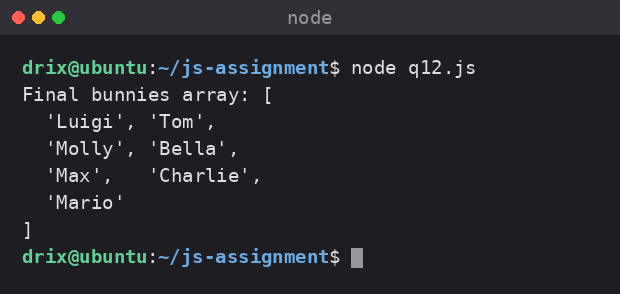

---

### Question 13

Using the array `['Lucy', 'Tom', 'Molly', 'Bella']`, print the first item, the last item without hard-coding index 3, the index of `'Tom'`, and a copy of the array that leaves the original unchanged.

**Solution**

```javascript
const bunnies = ['Lucy', 'Tom', 'Molly', 'Bella'];

console.log(bunnies[0]);                     // first item
console.log(bunnies[bunnies.length - 1]);    // last item
console.log(bunnies.indexOf('Tom'));         // index of 'Tom'
console.log([...bunnies]);                   // copy
```

**Output**

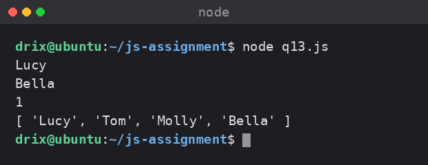

---

### Question 14

Loop through `bunnies` with a `for` loop and print `Bunny Lucy is scheduled for a checkup today.` for every name in the array.

**Solution**

```javascript
const bunnies = ['Lucy', 'Tom', 'Molly', 'Bella'];

for (let i = 0; i < bunnies.length; i++) {
  console.log(`Bunny ${bunnies[i]} is scheduled for a checkup today.`);
}
```

**Output**

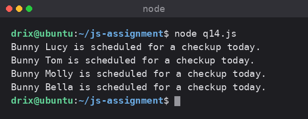

---

### Question 15

Using the nested array below, print `'Lucy'`, `'Bella'`, and then print every name with nested loops.

```javascript
const nestedArrays = [
  ['Lucy', 'Tom'],
  ['Molly', 'Bella'],
];
```

**Solution**

```javascript
const nestedArrays = [
  ['Lucy', 'Tom'],
  ['Molly', 'Bella'],
];

console.log(nestedArrays[0][0]);   // Lucy
console.log(nestedArrays[1][1]);   // Bella

for (const nestedArray of nestedArrays) {
  for (const name of nestedArray) {
    console.log(name);
  }
}
```

**Output**

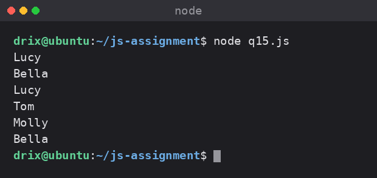

---

## JSON

### Question 16

Create a JavaScript object called `bunny` with `name`, `age`, and `isHappy`. Convert it to JSON, store it in `bunnyJSON`, and print `bunnyJSON`.

**Solution**

```javascript
let bunny = {
  name: "Lucy",
  age: 3,
  isHappy: true
};

let bunnyJSON = JSON.stringify(bunny);
console.log("Bunny JSON:", bunnyJSON);
```

**Output**

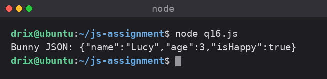

---

### Question 17

Start with the JSON string `'{"name":"Lucy","age":3,"isHappy":true}'`. Convert it back to a JavaScript object and print `name` and `age`.

**Solution**

```javascript
let bunnyJSON = '{"name":"Lucy","age":3,"isHappy":true}';

let bunnyObject = JSON.parse(bunnyJSON);
console.log("Bunny's name:", bunnyObject.name);
console.log("Bunny's age:", bunnyObject.age);
```

**Output**

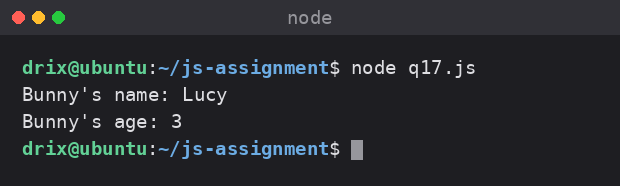

---

## Comparison Operators

### Question 18

Given `let bunny_age = 3;` and `let dog_age = '3';`, print the result of `==`, `===`, `!=`, and `!==`. Then explain the difference between `==` and `===` in one sentence.

**Solution**

```javascript
let bunny_age = 3;
let dog_age = '3';

console.log("bunny_age == dog_age:", bunny_age == dog_age);
console.log("bunny_age === dog_age:", bunny_age === dog_age);
console.log("bunny_age != dog_age:", bunny_age != dog_age);
console.log("bunny_age !== dog_age:", bunny_age !== dog_age);
```

**Output**

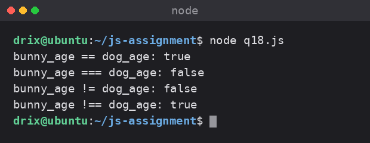

**Explanation**

`==` compares values after coercing them to a common type, while `===` compares both value and type with no coercion.

---

### Question 19

Create two arrays, `bunnies` and `dogs`, with any number of names. Use `<=` to compare their lengths and print the matching message.

**Solution**

```javascript
let bunnies = ['Lucy', 'Tom', 'Molly'];
let dogs = ['Max', 'Buddy', 'Charlie', 'Rocky'];

if (bunnies.length <= dogs.length) {
    console.log("There are more dogs than bunnies");
} else {
    console.log("There are more bunnies than dogs");
}
```

**Output**

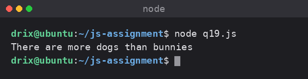

---

## Conditional Statements

### Question 20

A bunny's health can be `'healthy'`, `'sick'`, or anything else. Write this check three ways: `if / else if / else`, a `switch` statement, and a ternary operator.

**Solution**

```javascript
let bunnyHealth = 'healthy';

// 1. if / else if / else
if (bunnyHealth === 'healthy') {
    console.log("The bunny is healthy.");
} else if (bunnyHealth === 'sick') {
    console.log("The bunny is sick.");
} else {
    console.log("The bunny's health status is unknown.");
}

// 2. switch
switch (bunnyHealth) {
    case 'healthy':
        console.log("The bunny is healthy.");
        break;
    case 'sick':
        console.log("The bunny is sick.");
        break;
    default:
        console.log("The bunny's health status is unknown.");
}

// 3. ternary
bunnyHealth === 'healthy'
    ? console.log("The bunny is healthy.")
    : console.log("The bunny's health status is unknown.");
```

**Output**

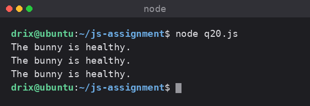

---

### Question 21

Write a function that takes a number and uses a ternary operator to return `'even'` or `'odd'`. Test it with `4`, `7`, and `0`.

**Solution**

```javascript
function evenOrOdd(num) {
    return num % 2 === 0 ? 'even' : 'odd';
}

console.log(evenOrOdd(4));
console.log(evenOrOdd(7));
console.log(evenOrOdd(0));
```

**Output**

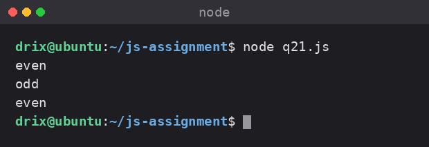

---

## Loops

### Question 22

Write a `for` loop that prints `0` through `9`. Then write a `while` loop that does the same thing.

**Solution**

```javascript
// for loop
for (let i = 0; i < 10; i++) {
    console.log(i);
}

// while loop
let j = 0;
while (j < 10) {
    console.log(j);
    j++;
}
```

**Output**

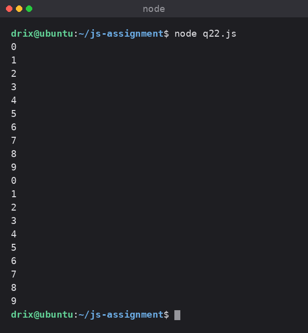

---

### Question 23

Write a `while` loop that counts down from 9 to 1 and prints each number. Then write the same countdown with a `for` loop.

**Solution**

```javascript
// while loop
let k = 9;
while (k > 0) {
    console.log(k);
    k--;
}

// for loop
for (let i = 9; i > 0; i--) {
    console.log(i);
}
```

**Output**

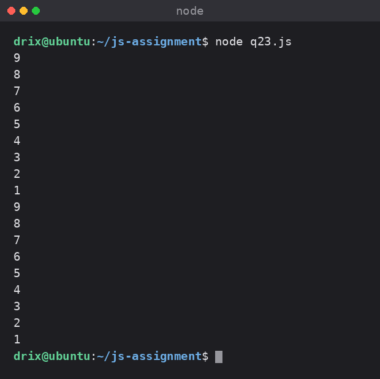

---

## Exception Handling and Operators

### Question 24

Write `sumBunnies(blackBunnies, whiteBunnies)` so it throws an error if either argument is not a number. Wrap a call to `sumBunnies(10, 'twenty')` in `try / catch` and print the error message.

**Solution**

```javascript
function sumBunnies(blackBunnies, whiteBunnies) {
    if (typeof blackBunnies !== "number" || typeof whiteBunnies !== "number") {
        throw new Error("Both arguments must be numbers.");
    }
    return blackBunnies + whiteBunnies;
}

try {
    console.log(sumBunnies(10, 'twenty'));
} catch (error) {
    console.error("Error:", error.message);
}
```

**Output**

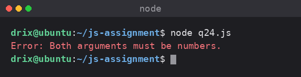

---

### Question 25

Write one small program that assigns `blackBunnies = 10` and `whiteBunnies = 5`, prints whether they are equal, prints the total, prints whether there are more than 12 bunnies in total, and prints `'Yes'` or `'No'` with a ternary.

**Solution**

```javascript
let blackBunnies = 10;
let whiteBunnies = 5;

console.log("Are blackBunnies and whiteBunnies equal?", blackBunnies === whiteBunnies);

let totalBunnies = blackBunnies + whiteBunnies;
console.log("Total bunnies:", totalBunnies);
console.log("Are there more than 12 bunnies in total?", totalBunnies > 12);
console.log("Is the total greater than 12?", totalBunnies > 12 ? "Yes" : "No");
```

**Output**

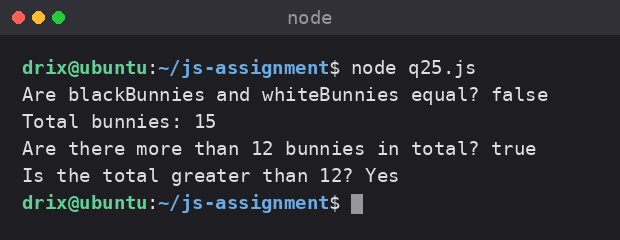

---

## Brain Teasers

### Brain Teaser 1: The quiet loop

What does this print, and why does it stop?

```javascript
let carrots = 3;

while (carrots) {
  console.log('munch');
  carrots--;
}
```

**Output**

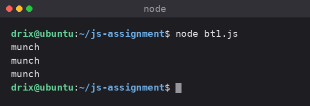

**Explanation**

The condition is the value `carrots` itself, not a comparison. Any non-zero number is truthy, so the loop runs while `carrots` is 3, 2, and 1. When it reaches `0` the value becomes falsy and the loop stops.

**What if you deleted `carrots--;`?**

`carrots` would stay at `3` forever, the condition would never become falsy, and the loop would run infinitely, printing `munch` until the process is killed.

---

### Brain Teaser 2: For vs while, same farm

Using `['Lucy', 'Tom', 'Molly', 'Bella', 'Mario', 'Luigi']`, print only the bunnies whose names have more than 4 letters, first with a `for` loop and then with a `while` loop. Both must print the same names.

**Solution**

```javascript
const bunnies = ['Lucy', 'Tom', 'Molly', 'Bella', 'Mario', 'Luigi'];

console.log("Using for loop:");
for (let i = 0; i < bunnies.length; i++) {
  if (bunnies[i].length > 4) {
    console.log(bunnies[i]);
  }
}

console.log("Using while loop:");
let index = 0;
while (index < bunnies.length) {
  if (bunnies[index].length > 4) {
    console.log(bunnies[index]);
  }
  index++;
}

console.log("Both loops printed the same names.");
```

**Output**

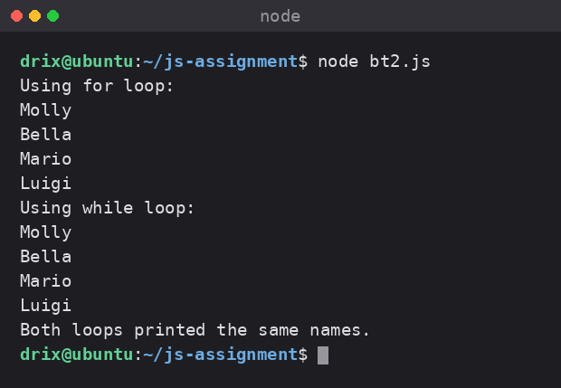

---

### Brain Teaser 3: Nested checkup

Using nested loops, print a numbered list where the numbers keep counting across all inner arrays instead of restarting at 1 for each pair.

**Solution**

```javascript
const nestedArrays = [
  ['Lucy', 'Tom'],
  ['Molly', 'Bella'],
  ['Mario', 'Luigi'],
];

let count = 1;
for (const innerArray of nestedArrays) {
  for (const name of innerArray) {
    console.log(`${count}. ${name}`);
    count++;
  }
}
```

**Output**

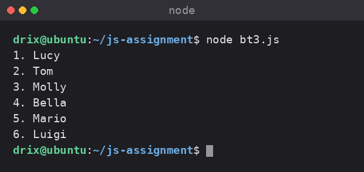

`count` is declared outside both loops so it survives across iterations of the outer loop.

---

### Brain Teaser 4: Loop, condition and function

Write `countHappyBunnies(bunnies)` that uses a loop to return how many bunnies have `isHappy === true`. Then use a ternary to print `'Most bunnies are happy'` if the happy count is at least half the array length, otherwise `'Most bunnies are not happy'`.

**Solution**

```javascript
const bunnies = [
  { name: 'Lucy', isHappy: true },
  { name: 'Tom', isHappy: false },
  { name: 'Molly', isHappy: true },
];

function countHappyBunnies(bunnies) {
  let happyCount = 0;
  for (const bunny of bunnies) {
    if (bunny.isHappy) {
      happyCount++;
    }
  }
  return happyCount;
}

const happyCount = countHappyBunnies(bunnies);
console.log("Number of happy bunnies:", happyCount);

const message = happyCount >= bunnies.length / 2
    ? 'Most bunnies are happy'
    : 'Most bunnies are not happy';

console.log(message);
```

**Output**

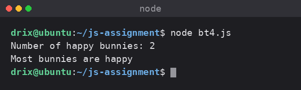

---

### Brain Teaser 5: The loop that almost lies

Predict the output of both snippets, then fix snippet B so it prints `0 1 2 3 4` like snippet A.

```javascript
// Snippet A
for (let i = 0; i < 5; i++) {
  console.log(i);
}

// Snippet B
let i = 0;
while (i < 5) {
  console.log(i);
}
```

**Prediction**

Snippet A prints `0` through `4`. Snippet B prints `0` forever, because `i` is never incremented so `i < 5` stays true.

**Snippet B fixed**

```javascript
let i = 0;
while (i < 5) {
  console.log(i);
  i++;
}
```

**Output**

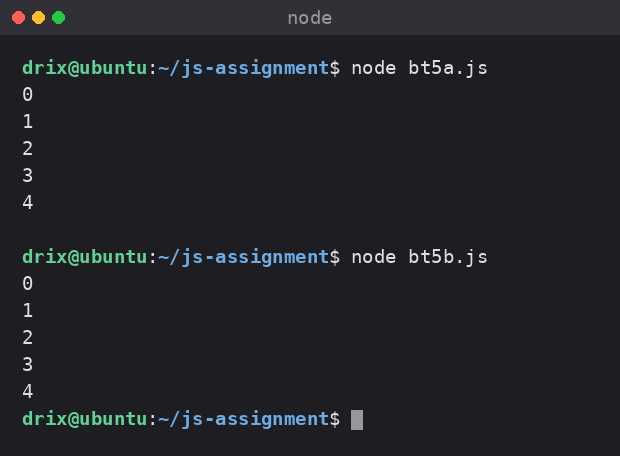

**When to pick which**

Use a `for` loop when the number of iterations is known up front, since the counter, condition and increment all sit on one line where they are hard to forget. Use a `while` loop when the loop should run until some condition changes and the iteration count is not known in advance.
