# Student API — The "Ghost Student" Incident

- **Part A** — my diagnosis, below
- **Part B** — the code, in `app.js`
- **Part C** — my test screenshots, below

Line numbers refer to the original `app.js`. I seeded four students to test with: Ada, ADA, Ada and Tari.

---

## My answers

### 1. `GET /get-student-by-name?name=Ada` uses `Student.find({ name })`

```js
const student = await Student.find({ name });
return res.status(200).json({ message: "Student fetched successfully", student });
```
*(lines 86–87)*

`find()` always returns an array. The route puts that array under a key called `student`, singular. The key says one object, the value is a list.

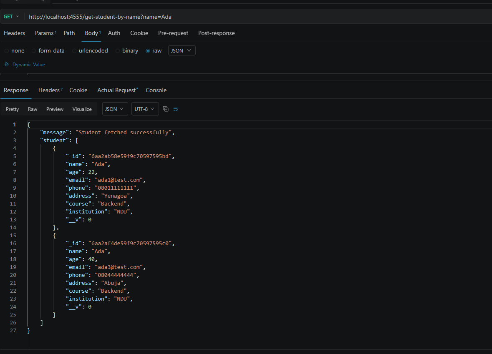

So a frontend developer writes `data.student.name` and gets `undefined`. The name is really at `data.student[0].name`.

When nothing matches, the value is `[]` and the status is still 200 with a success message:

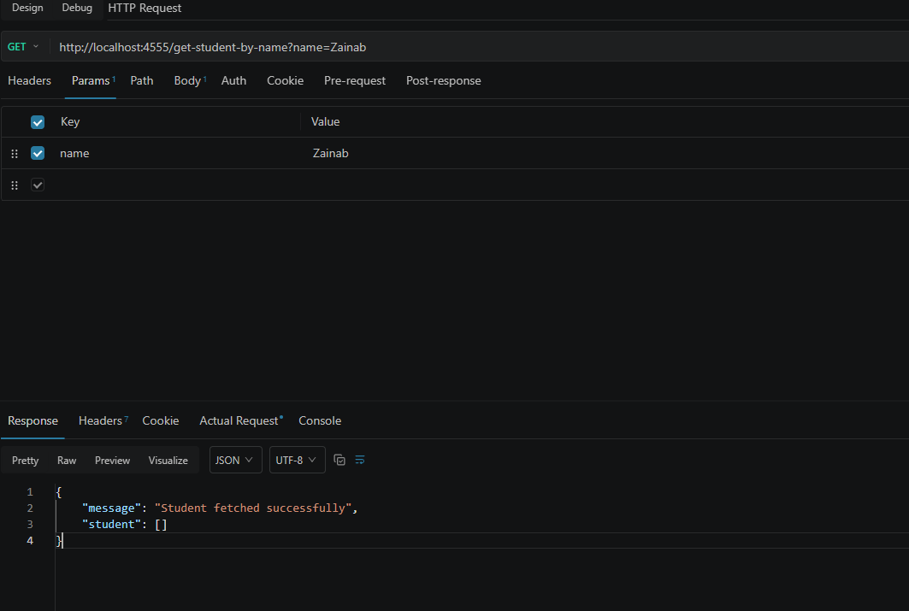

The route cannot tell "found students" from "found nothing".

**Would `findOne` behave differently?**

Yes. It returns one document or `null`, never an array. But it is the wrong fix here. With two Adas it returns whichever one MongoDB gives first and never tells the client a second one exists.

- Use `findOne` when only one match is possible, like a lookup by unique email.
- Use `find` when many matches are possible, like a search. Then name the key `students`.

---

### 2. The route is case-sensitive and needs an exact name

A plain string query value is an exact match in MongoDB, byte for byte. So `ada`, `Ada` and `Ada ` are three different searches.

`?name=ada` finds nothing:

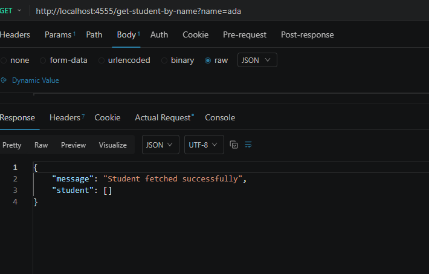

`?name=ADA` finds only the uppercase record:

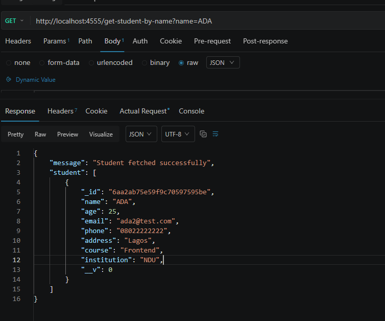

Extra characters on the end find nothing:

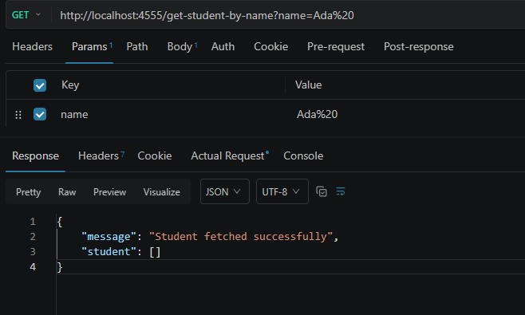

All three return 200 with a success message. So a typo looks exactly like a real absence.

**Research: case-insensitive search without filtering in Node**

Regex with the `i` option:

```js
Student.find({ name: { $regex: q, $options: "i" } })
```

MongoDB does the matching, and it also gives partial matches — `ada` matches `Adaeze`. Two costs: it cannot use an index efficiently, so it scans the collection; and user input is read as a pattern, so `.` and `*` must be escaped.

Collation:

```js
Student.find({ name }).collation({ locale: "en", strength: 2 })
```

Strength 2 ignores case at database level and can use an index, so it is faster. But it matches whole values only.

I used regex in Part B.1 because I needed partial matching across three fields.

---

### 3. `PUT /update-student/:id` with `{ new: true }`

```js
const { id } = req.params;
const { name, age, email, phone, address, course, institution } = req.body;
const student = await Student.findByIdAndUpdate(id, { name, age, ... }, { new: true });
```
*(lines 73–76)*

**Reason one — how she is calling it.**

Line 73 reads the id from `req.params`. Nothing reads `req.body.id`.

If she puts the id in the body and calls `PUT /update-student` with nothing after the slash, no route matches. Express returns HTML, not JSON.

Wrong method does the same:

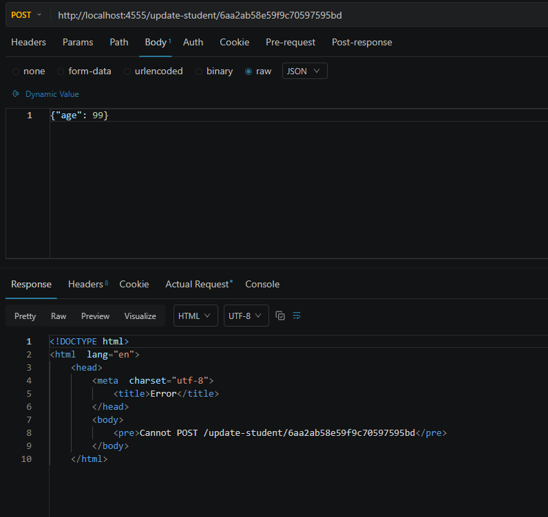

I sent the id in both the URL and the body. The update worked and the body `id` was ignored:

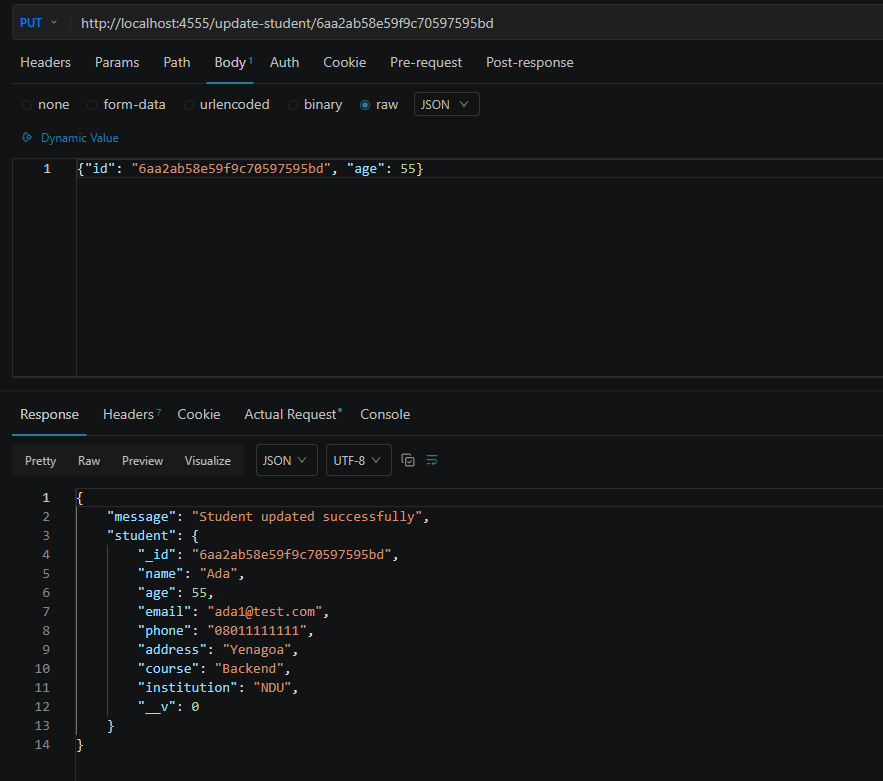

There is also a cause that is not a bug. With three Adas, she can update one and check another:

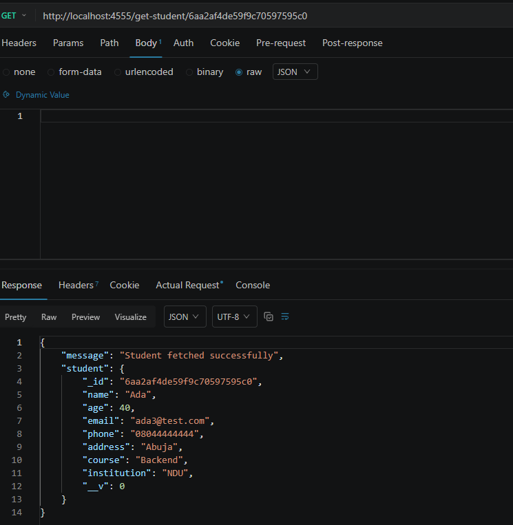

**Reason two — Mongoose options.**

`{ new: true }` returns the document after the update. The default `new: false` returns it as it was before, so the response would show the old age even though the database changed. That is the classic version of this bug. The option is present here, so it is not the cause — but removing it would cause exactly what she describes.

**Fields she did not send.** Line 74 destructures all seven fields, so a body of `{ "age": 99 }` sends six `undefined` values. Mongoose strips those out, so the other fields survive:

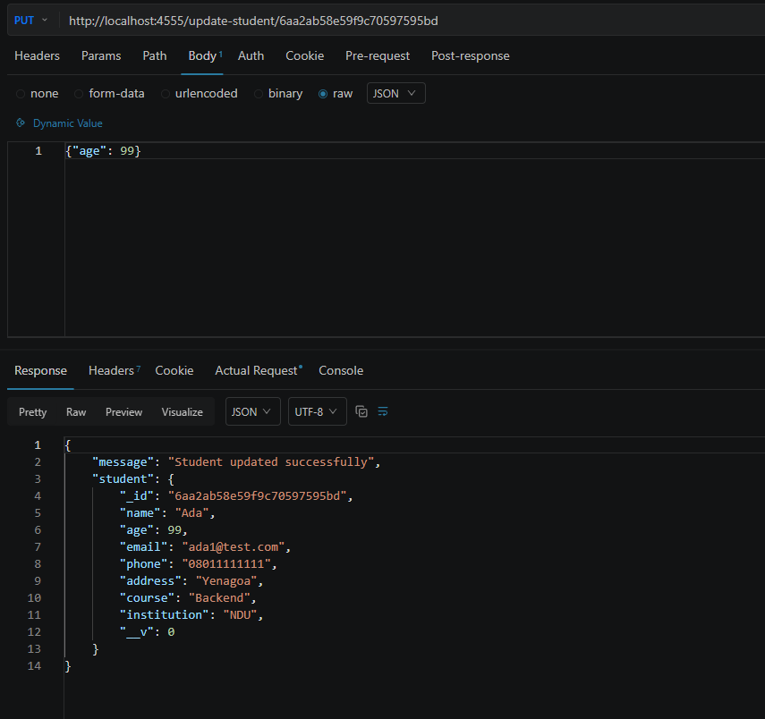

That is safe by accident, not by design. If the client sent `null` instead of leaving keys out, the fields would be wiped.

**`runValidators`** defaults to false on `findByIdAndUpdate`. Validators run on `save()` but are skipped on update. So an update can write a value a create would reject. I turn it on in Part B.3.

---

### 4. `GET /get-student/:id`

```js
const student = await Student.findById(id);
return res.status(200).json({ message: "Student fetched successfully", student });
```
*(lines 64–65)*

**Valid id, student exists** → 200 with the document. Correct.

**Valid id, no student** → `findById` returns `null`. Nothing is thrown, because the query ran fine and just matched nothing. So the catch never fires and line 65 sends `"student": null` with status 200:

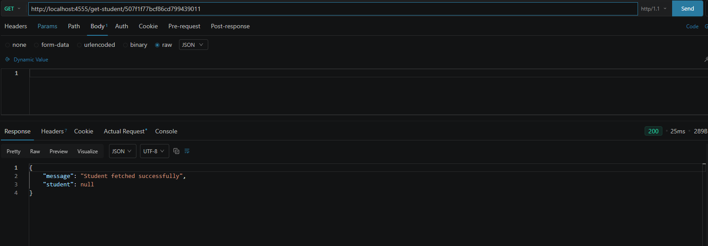

**Invalid id `abc123`** → 500:

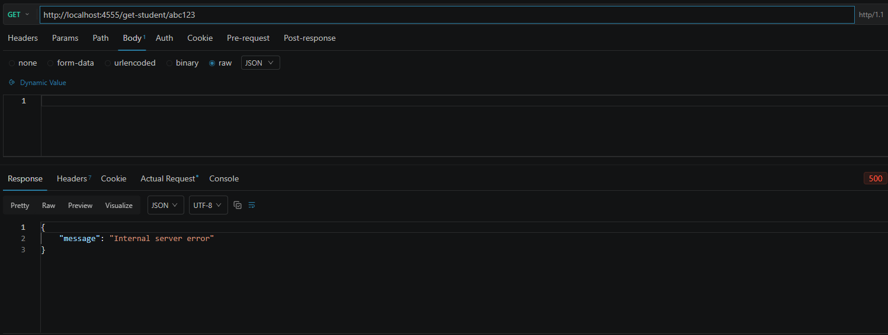

Mongoose has to cast the string to an ObjectId before it can build a query. An ObjectId is 24 hex characters. `abc123` is six, so it cannot be cast and Mongoose throws a `CastError` before anything reaches MongoDB. The catch has one response for every error, so it returns 500.

I logged the error to confirm:

```
ERROR NAME: CastError | PATH: _id | VALUE: abc123
```

Nothing was logged for the absent id, because nothing was thrown.

**Research: `CastError` vs not found**

|  | `CastError` | Not found |
|---|---|---|
| When | Before the query, input cannot be cast | After the query, it matched nothing |
| Mongoose | Throws | Returns `null` |
| Cause | Malformed id | Valid id, resource does not exist |
| Correct status | **400** | **404** |

500 is wrong for both. It tells the client the server failed and invites a retry, but retrying `abc123` will never work.

---

### 5. `mongoose.model("Student", studentSchema)`

```
$ mongosh techSchoolApp --eval "db.getCollectionNames()"
[ 'students' ]
```

The collection is `students`, not `Student`. Mongoose lowercases the model name and pluralises it.

**Why it matters.** Anyone querying the database directly uses the name they saw in the code:

```js
db.Student.find()      // nothing
db.students.find()     // the data
```

MongoDB does not error on an unknown collection. It treats `db.Student` as an empty one and returns `[]`. So the wrong query gives a clean, convincing, wrong answer, and you conclude the API is not saving anything — while the data sits in `students`.

Fix: pass an explicit collection name as the third argument to `mongoose.model`, or run `db.getCollectionNames()` before trusting an empty result.

---

### 6. Why `POST /create-student` fails without `Content-Type: application/json`

**The line that makes `req.body` work is line 8:**

```js
app.use(express.json());
```

Without it, `req.body` is never populated on any route.

`express.json()` only parses the body when the header says `application/json`. Any other type and it leaves the request alone, so `req.body` is never set.

I sent the same payload three ways:

| Content-Type | `req.body` | Result |
|---|---|---|
| `application/json` | `{ name: 'Test', email: 't@test.com' }` | 200, saved |
| `text/plain` | `undefined` | 500, HTML stack trace |
| none | `undefined` | 500, HTML stack trace |

Working baseline, with the parsed body in the terminal:

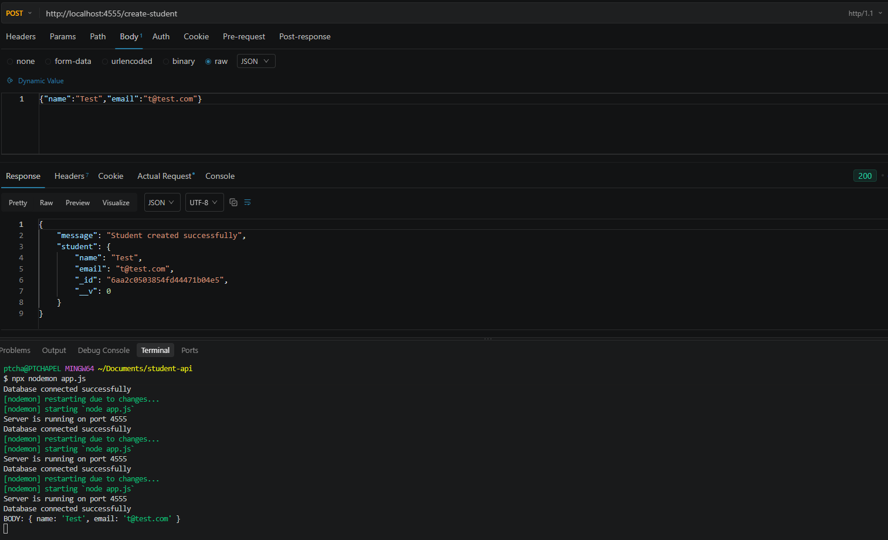

The saved document only holds `name`, `email`, `_id` and `__v`. Fields I did not send are absent, not `null` — same behaviour as question 3:

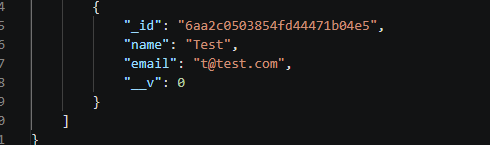

Plain text gives a 500 with an HTML stack trace:

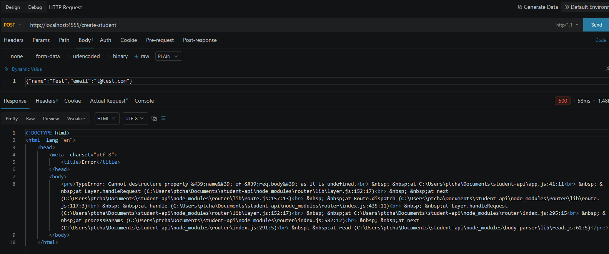

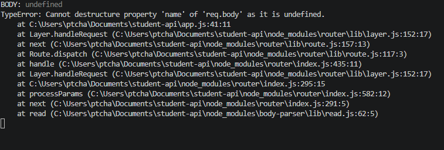

No body behaves the same:

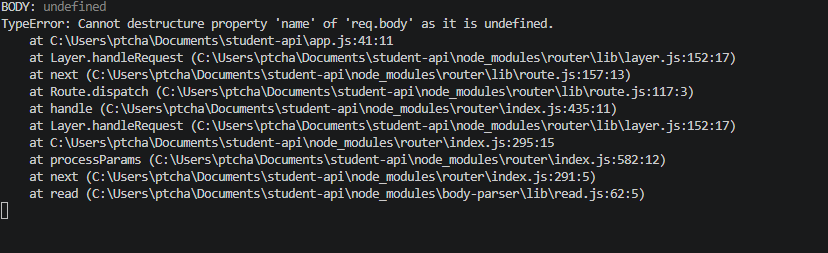

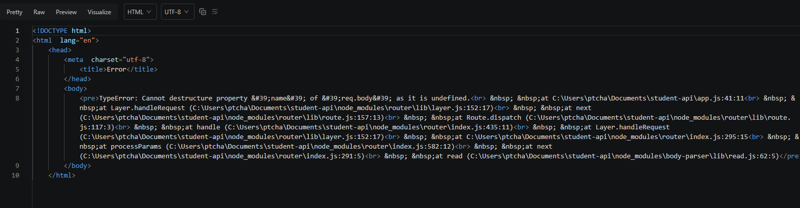

The crash itself:

```
TypeError: Cannot destructure property 'name' of 'req.body' as it is undefined.
    at app.js:41:11
```

**Where the throw happens matters:**

```js
app.post("/create-student", async (req, res) => {
  const { name, age, email, phone, address, course, institution } = req.body;
try {
```
*(lines 39–41)*

Line 40 sits outside the `try`, which only opens on line 41. So the route's own catch never sees this error. It escapes to Express, which sends HTML — including a stack trace with server file paths that should never reach a client.

Two problems: the body is not parsed, and the code reading it sits where its failure cannot be caught.

---

### Extra — `DELETE /delete-student/:id`

Not one of the six questions, but it is the admin's fifth complaint.

```js
await Student.findByIdAndDelete(id);
return res.status(200).json({ message: "Student deleted successfully" });
```
*(lines 97–98)*

`findByIdAndDelete` returns the deleted document, or `null` if nothing matched. Line 97 throws that value away, so line 98 always reports success:

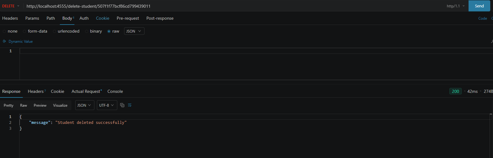

Fixed in Part B.5.

---

## Part B — What I added

### Schema

```js
name:   { type: String, required: true },
email:  { type: String, required: true, unique: true },
course: { type: String, minlength: 3 },
```

`unique` is not a validator. It tells MongoDB to build a unique index. Mongoose does not check it before saving — MongoDB rejects the duplicate at write time and throws error code `11000`. So the create route handles `11000` separately from a `ValidationError`.

The index only builds if the collection has no existing duplicates. I confirmed mine built:

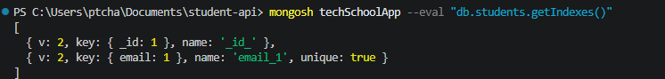

### Error mapping

Every route used to end with the same `return res.status(500)`. That is why `abc123` gave 500 instead of 400. I added one helper:

```js
const handleError = (res, error) => {
  if (error.name === "CastError")       return res.status(400).json({ ... });
  if (error.name === "ValidationError") return res.status(400).json({ message: error.message });
  if (error.code === 11000)             return res.status(409).json({ ... });
  console.log("Unexpected error:", error);
  return res.status(500).json({ message: "Internal server error" });
};
```

Note `error.code` for the duplicate, not `error.name`. A duplicate key error is not a Mongoose validation error — it comes from MongoDB, so it has a number instead of a name.

### 1. `GET /search-students`

Reads `q` from the query string. A missing or blank `q` gets 400, not the whole database.

Matches `name`, `email` or `course` using `$or` with `$regex` and `$options: "i"`. MongoDB does the matching — I do not fetch everything into Node and filter it.

I escape the user's input before using it as a pattern. Without that, `.*` would match every student and a stray `(` would throw and give a 500.

No match returns 200 with `[]`, not 404. The search ran fine — "nothing matches" is a valid answer, not a missing endpoint. 404 would mean `/search-students` does not exist. This way the client always gets an array and just checks its length.

The response key is `students`, plural, which fixes the naming problem from question 1.

### 2. Hardened `GET /get-student/:id`

| Input | Status |
|---|---|
| Not a valid ObjectId | 400 |
| Valid ObjectId, no student | 404 |
| Student found | 200 |

The guard uses `mongoose.Types.ObjectId.isValid`. Its limitation, noted in a code comment: it only checks the shape of the string. Any 24-character hex string passes, so `aaaaaaaaaaaaaaaaaaaaaaaa` gets through and then matches nothing. That is why I still need the 404 check after it. `isValid` rules out malformed input, it does not promise the student exists.

### 3. `PATCH /students/:id/course`

Changes only `course`, read from the JSON body. 400 for an invalid id, 400 for a missing or empty course, 404 if no student matches.

Two options on `findByIdAndUpdate`:

- **`new: true`** — returns the document after the update. The default returns it as it was before, so the response would show the old course.
- **`runValidators: true`** — defaults to false. Validators run on `save()` but are skipped on update unless this is on. With it off, a 1-character course would be written straight past `minlength: 3`. With it on, Mongoose throws a `ValidationError`, which `handleError` maps to 400.

### 4. Unique email on create

Duplicate email now returns 409, not 500. Missing name or email returns 400. A successful create returns 201 instead of 200.

I also moved the destructuring of `req.body` inside the `try`. It used to sit outside it, which is why the wrong `Content-Type` crashed past the catch — see question 6.

### 5. Honest delete

| Input | Status |
|---|---|
| Not a valid ObjectId | 400 |
| Valid ObjectId, no student | 404 |
| Student deleted | 200 |

The route now checks what `findByIdAndDelete` returns, which is `null` when nothing matched.

**Why 200 and not 204:** 204 means "success, no content" and must have an empty body, so the client gets no confirmation of what was removed. 200 lets me return the deleted student, which is more useful and makes the delete verifiable.

---

## Part C — My tests

| # | Test | Expected | Result |
|---|---|---|---|
| 1 | Search `q=ada` finds Ada and ADA | 200, array length 2+ | 200, 3 students |
| 2 | Search with no `q` | 400 | 400 |
| 3 | `GET /get-student/abc123` | 400, not 500 | 400 |
| 4 | `GET /get-student/` + absent id | 404, not 200 | 404 |
| 5 | PATCH course on a real student | new course in body | 200, new course shown |
| 6 | PATCH `{"course": "A"}` | 400, not 500 | 400 |
| 7 | Two students, same email | second is 409 | 409 |
| 8 | Delete an id that does not exist | 404 | 404 |

### 1. Search `q=ada`

Returns all three Adas — `Ada`, `ADA` and `Ada` — so case is ignored.

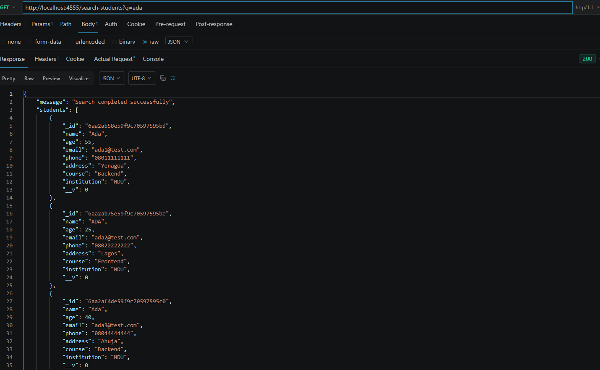

`q=backend` matches on course, which shows `$or` reaching past `name`:

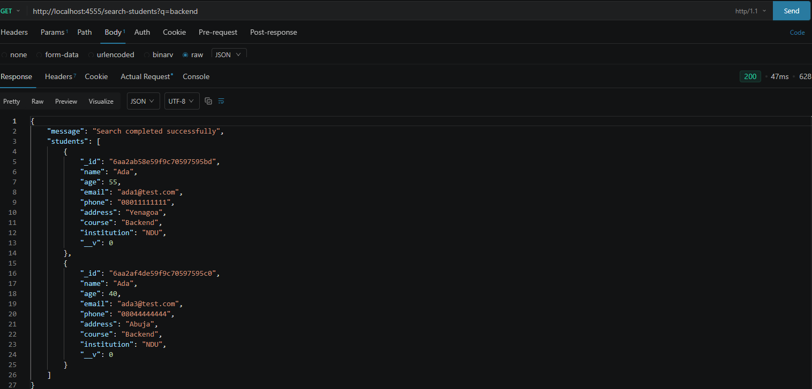

A term matching nothing returns 200 with an empty array:

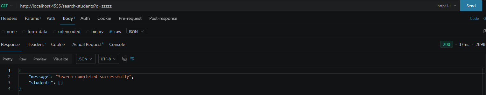

### 2. Search with no `q` → 400

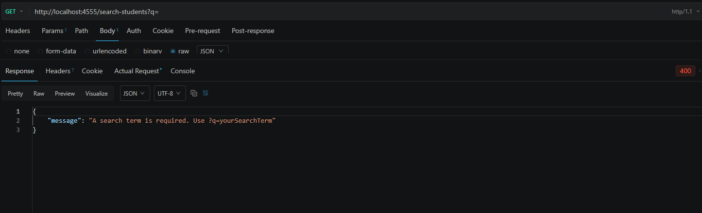

### 3. `GET /get-student/abc123` → 400

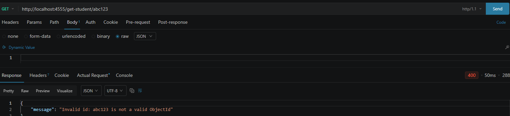

### 4. Absent id → 404

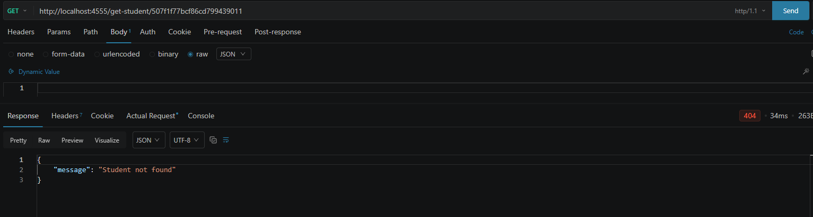

A real id still returns 200:

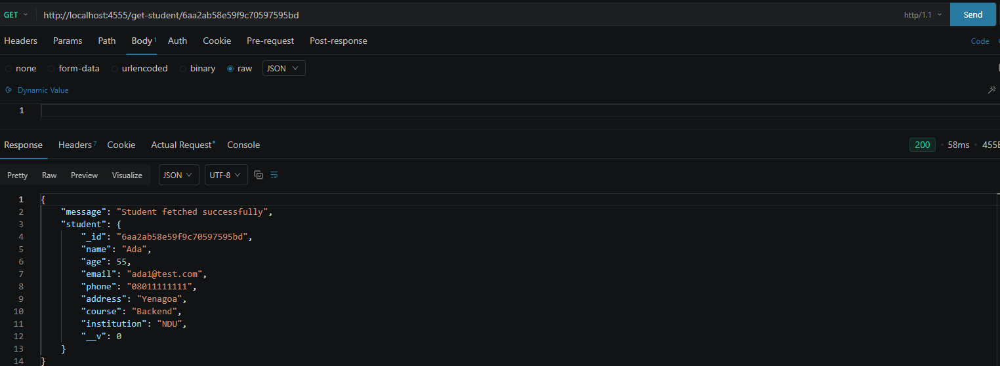

### 5. PATCH course → 200 with the new course

The body shows `"course": "Data Analysis"`, which only happens because of `new: true`.

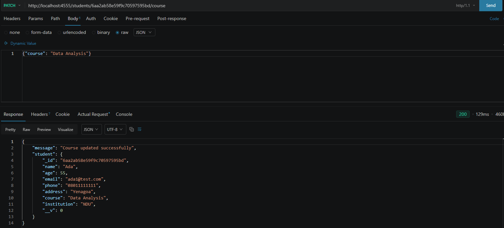

### 6. PATCH `{"course": "A"}` → 400

The message names the path, the value, its length and the minimum. That only appears when `runValidators: true` is set.

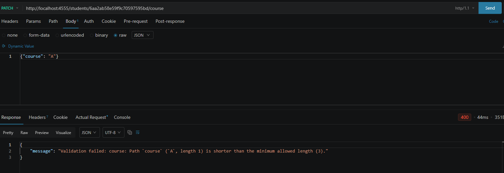

An empty body is rejected before it reaches the database:

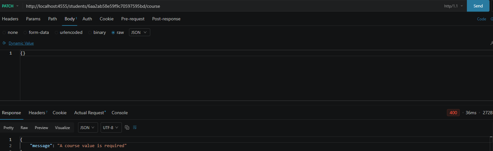

Patching a student that does not exist returns 404:

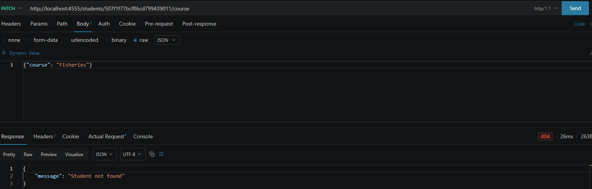

### 7. Duplicate email → 409

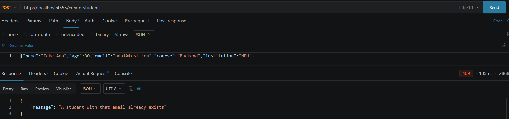

Missing email returns 400 from `required`:

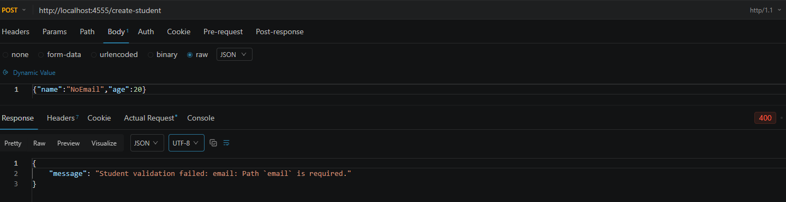

A valid new student returns 201:

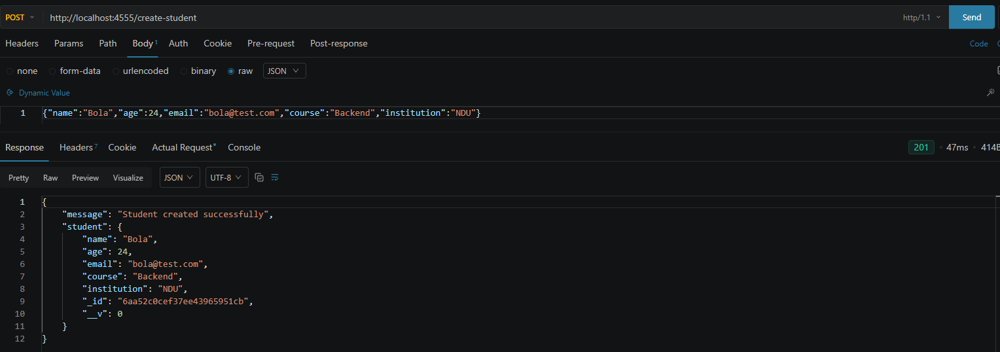

### 8. Delete an absent id → 404


An invalid id returns 400:

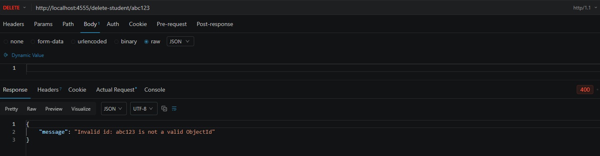

A real delete returns 200 with the removed student:

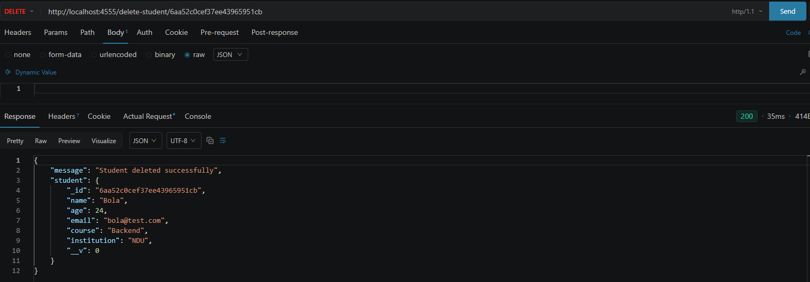

### Existing routes still work

After the schema and route changes I re-ran `GET /`, `GET /get-students`, `GET /get-student-by-name?name=Ada` and `PUT /update-student/:id`. All returned 200.

---
